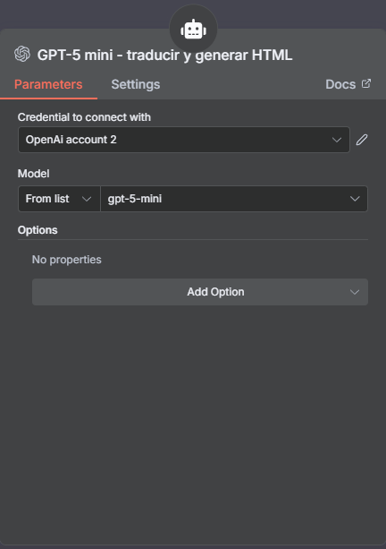

# 📰 Newsletter Automático de Noticias TechCrunch con n8n + IA

Este workflow de **n8n** obtiene las últimas noticias desde **TechCrunch Latest**, las traduce al español mediante IA, genera un newsletter en HTML y lo envía automáticamente por email.

---

## 🛠️ Tecnologías
- n8n
- OpenAI (GPT-5 mini)
- Scraping / Request HTTP
- HTML para emails
- Gmail API

⚠️ Nota: Las noticias se obtienen mediante scraping del HTML de TechCrunch, no mediante API oficial.

---

## 🔧 Nodos del Workflow

### ⏰ Disparador de horario
Activa el flujo automáticamente en el horario configurado.

### 🌐 HTTP Request a TechCrunch Latest
- Realiza un request GET a:  
  `https://techcrunch.com/latest`  
- Extrae títulos, descripciones y enlaces de cada noticia.

### 🤖 AI Agent (OpenAI – GPT-5 mini)
Procesa el contenido con IA:  
- Traduce las noticias al español  
- Resume información clave  
- Genera HTML limpio  
- Mantiene los enlaces clickeables  
- Produce un bloque final HTML para el email

### 🗓️ Formato de fecha (Function / Set)
- Genera la fecha actual con: `{{$now}}`  
- Esto se muestra en el encabezado del newsletter.

### 📨 Render del email en HTML
- Inserta el contenido generado por IA dentro de una plantilla HTML con título, links a la URL de la noticia.

### 📬 Gmail Node – Envío del newsletter
- Envía automáticamente el newsletter al correo configurado.

---

## 📦 Cómo usarlo
1. Importar `WorkflowNoticias.json` en tu instancia de n8n.  
2. Configurar las credenciales de **OpenAI** y **Gmail**.  
3. Ajustar el horario del disparador si lo necesitás.  
4. Ejecutar el workflow.

---

## 🖼️ Screenshots

### 🧩 Workflow completo en n8n

### 🧠 Prompt utilizado en IA

### 🤖 Modelo utilizado (GPT-5 mini)

### ✉️ Email generado (con links clickeable)

### 🌐 Noticia original en TechCrunch

